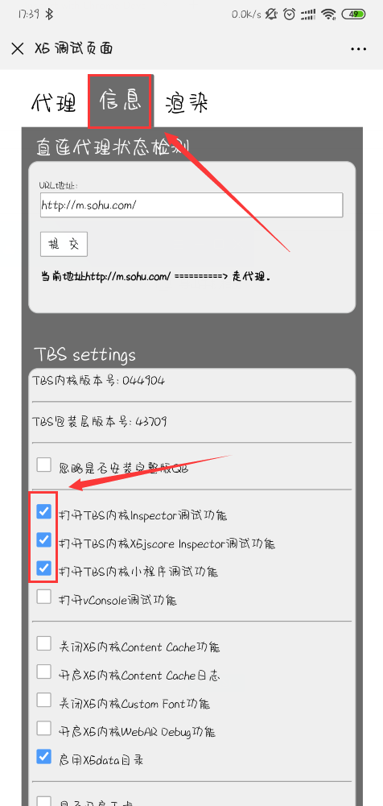
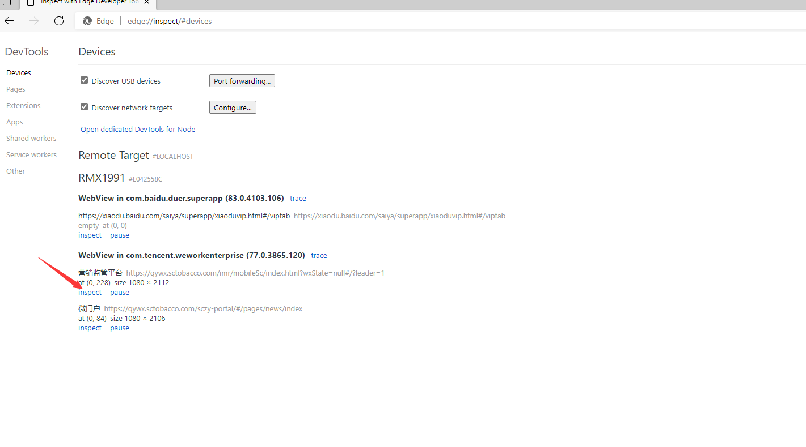

# 企业微信调试
## 手机端
### [开发者模式](https://jingyan.baidu.com/article/a501d80c55777dec630f5ee8.html)
- 我们打开手机【设置】菜单，进入到菜单列表后再点击进入【更多设置】菜单项。
- 进入到功能界面找到【关于手机】点击进去，最后找到【软件版本号】连续点击七到十次左右就可以开启了。
- “开发者选项”在“更多设置”页面的最下方。
- 点击“开发者选项”，进入到开发者选项页面，在开发者选项中我们很容以就找到“USB调试”
- 我们只需要把USB调试勾选，即可实现开启手机的USB调试模式了。

### 企业微信调试内核
- 手机微信端打开http://debugx5.qq.com，可以通过聊天窗口发送，然后点击链接
- 点击安装线上内核，会提示重启企业微信
- 点击debugx5，然后如图勾选选项

> 打开inspector调试功能

### 调试
- 通过usb将手机插入电脑usb口，然后在手机弹出的选择项中选择传输文件项
- 打开最新版本的edge浏览器，输入edge://inspect/#devices，手机端会提示是否允许，选择允许
- 打开企业微信，点击精准营销
- 稍等一会在edge页面会出现如图

> 打开浏览器调试页面
- 点击营销监管平台下面的inspect按钮，进入调试页面

> 浏览器调试功能